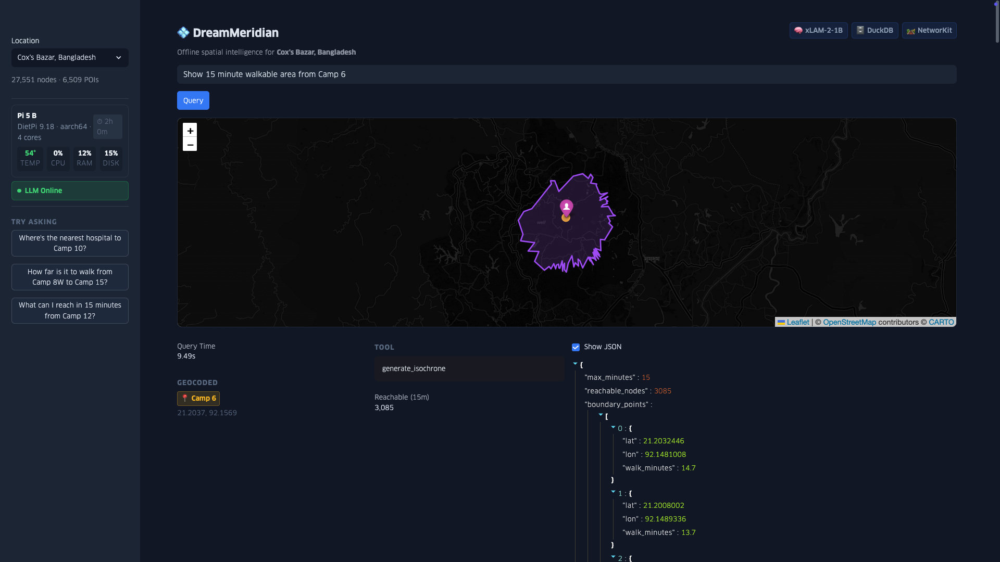

# 💠 DreamMeridian

**Offline AI-Powered Spatial Intelligence for ARM Devices**

DreamMeridian is a fully offline spatial query system that runs entirely on ARM-based devices like Raspberry Pi 5. It combines a quantized LLM (xLAM-2-1B) with high-performance graph routing and spatial databases to answer natural language questions about geographic data—without any cloud connectivity.

Built for humanitarian scenarios where internet access is unreliable: refugee camp navigation, disaster response coordination, and field operations planning.

**Author:** [Adam Munawar Rahman](https://github.com/msradam)


---

> **🎬 [Watch the Demo](https://www.youtube.com/watch?v=80KqDcOSRPc)** (3 min) — See DreamMeridian running on a Raspberry Pi 5

> **📖 [Full Project Writeup](WRITEUP.md)** — Technical deep-dive, ARM optimization rationale, benchmarks, and humanitarian context for the ARM AI Developer Challenge 2025

---


*Web dashboard showing isochrone analysis in Cox's Bazar refugee camps*

---

## 📑 Table of Contents

- [Key Features](#-key-features)
- [Architecture](#️-architecture)
- [Pre-Built Datasets](#-pre-built-datasets)
- [Requirements](#-requirements)
- [Installation](#-installation)
- [Running DreamMeridian](#-running-dreammeridian)
- [Recommended Queries](#-recommended-queries)
- [Benchmark Results](#-benchmark-results)
- [Spatial Tools](#-spatial-tools)
- [Project Structure](#-project-structure)
- [Troubleshooting](#️-troubleshooting)
- [Contributing](#-contributing)
- [Acknowledgments](#-acknowledgments)
- [License](#-license)

---

## 🎯 Key Features

- **100% Offline**: All AI inference runs locally on ARM CPU—no cloud, no API keys
- **Natural Language Queries**: Ask questions like "Find hospitals near Camp 6" or "Show 15 minute walkable area from Condado"
- **Real Routing**: Actual walking routes calculated on road network graphs (not straight-line distances)
- **Three Disaster Response Scenarios**: Pre-built datasets for Cox's Bazar, San Juan, and Jakarta
- **Sub-15 Second Response**: Optimized for Raspberry Pi 5 with ARM NEON/dotprod instructions

---

## 🏗️ Architecture
```
┌─────────────────────────────────────────────────────────────────┐
│                        Natural Language Query                   │
│                "Find nearest hospital to Camp 6"                │
└─────────────────────────────────────────────────────────────────┘
                                  │
                                  ▼
┌─────────────────────────────────────────────────────────────────┐
│  Geocoding Layer                                                │
│  Place name → lat/lon: "Camp 6" → (21.20, 92.16)                │
│  Modified query: "Find nearest hospital to (21.20, 92.16)"      │
└─────────────────────────────────────────────────────────────────┘
                                  │
                                  ▼
┌─────────────────────────────────────────────────────────────────┐
│  xLAM-2-1B (Q5_K_M)  │  Tool-calling LLM optimized for ARM      │
│  via llama.cpp       │  NEON + dotprod + GBNF grammar           │
│  Selects tool + generates arguments with resolved coordinates   │
└─────────────────────────────────────────────────────────────────┘
                                  │
                                  ▼
┌─────────────────────────────────────────────────────────────────┐
│  Spatial Tools                                                  │
│  list_pois │ find_nearest_poi_with_route │ calculate_route      │
│  find_along_route │ generate_isochrone │ geocode_place          │
└─────────────────────────────────────────────────────────────────┘
                                  │
                    ┌─────────────┴─────────────┐
                    ▼                           ▼
┌──────────────────────────┐    ┌──────────────────────────────────┐
│  DuckDB + Spatial        │    │  NetworKit Graph Engine          │
│  POI queries, geocoding  │    │  Dijkstra routing on road network│
│  ~6K-41K POIs per city   │    │  ~25K-208K nodes per city        │
└──────────────────────────┘    └──────────────────────────────────┘
```

---

## 📍 Pre-Built Datasets

Three disaster response scenarios with pre-built offline data:

| Location | Context | Nodes | Edges | POIs | Place Names |
|----------|---------|-------|-------|------|-------------|
| `coxs_bazar` | Rohingya refugee camps, Bangladesh | 27,551 | 71,530 | 6,509 | 464 |
| `san_juan` | Hurricane response, Puerto Rico | 24,602 | 61,055 | 11,351 | 405 |
| `jakarta` | Urban flood response, Indonesia | 208,281 | 508,954 | 41,028 | 331 |

Data sourced from [OpenStreetMap](https://www.openstreetmap.org/) via OSMnx. Includes hospitals, clinics, pharmacies, schools, shelters, banks, markets, fuel stations, police stations, and places of worship.

---

## 📋 Requirements

### Hardware
- **Raspberry Pi 5** (8GB+ RAM recommended) or any ARM64 device
- ~4GB storage for models and data
- Tested on: Pi 5 16GB running DietPi, M3 MacBook Air

### Software Prerequisites
```bash
# System packages (Debian/Ubuntu/DietPi/Raspberry Pi OS)
sudo apt update
sudo apt install -y build-essential cmake git python3 python3-venv libopenblas-dev

# uv (fast Python package manager)
curl -LsSf https://astral.sh/uv/install.sh | sh
source ~/.bashrc  # or restart shell
```

---

## 🚀 Installation

> Full instructions including Apple Silicon (macOS) setup are available in **[INSTALL.md](INSTALL.md)**.

### 1. Clone the Repository
```bash
git clone https://github.com/msradam/dream-meridian.git
cd dream-meridian
```

### 2. Install Python Dependencies
```bash
uv sync
```

### 3. Build llama.cpp (ARM-Optimized)
```bash
git clone https://github.com/ggerganov/llama.cpp.git
cd llama.cpp && mkdir build && cd build

# Configure for Cortex-A76 (Pi 5)
cmake .. \
    -DCMAKE_BUILD_TYPE=Release \
    -DCMAKE_C_FLAGS="-mcpu=cortex-a76 -O3 -ffast-math -fno-finite-math-only" \
    -DCMAKE_CXX_FLAGS="-mcpu=cortex-a76 -O3 -ffast-math -fno-finite-math-only" \
    -DGGML_NATIVE=ON \
    -DGGML_LTO=ON \
    -DLLAMA_CURL=OFF

cmake --build . -j4 --config Release
cd ../..
```

### 4. Download the LLM
```bash
mkdir -p models

uv run --with huggingface-hub hf download \
    Salesforce/xLAM-2-1b-fc-r-gguf \
    xLAM-2-1B-fc-r-Q5_K_M.gguf \
    --local-dir ./models
```

### 5. Verify Installation
```bash
ls -la llama.cpp/build/bin/llama-server  # Should exist
ls -la models/*.gguf                      # Should show ~1.1GB file
ls -la data/                              # Should show coxs_bazar, san_juan, jakarta
```

---

## 🎮 Running DreamMeridian

### Start the LLM Server (Terminal 1)
```bash
./llama.cpp/build/bin/llama-server \
    -m ./models/xLAM-2-1B-fc-r-Q5_K_M.gguf \
    --grammar-file tool_grammar.gbnf \
    -c 2048 -t 4 --mlock \
    --host 0.0.0.0 --port 8080
```

Wait for "server is listening on http://0.0.0.0:8080".

### Command Line Interface (Terminal 2)
```bash
uv run python dream-meridian.py -l <location> "<query>"
```

### Streamlit Dashboard (Terminal 2)
```bash
uv run streamlit run app.py --server.port 8501
```

Open http://[pi-ip-address]:8501 in your browser.

---

## 💬 Recommended Queries

### Cox's Bazar, Bangladesh (Rohingya Refugee Camps)
```bash
uv run python dream-meridian.py -l coxs_bazar "I need to find the nearest hospital to Camp 6"
uv run python dream-meridian.py -l coxs_bazar "How do I walk from Camp 3 to Camp 8W"
uv run python dream-meridian.py -l coxs_bazar "Show me everywhere I can walk to in 15 minutes from Camp 8W"
```

### San Juan, Puerto Rico (Hurricane Response)
```bash
uv run python dream-meridian.py -l san_juan "Where is the closest hospital to Condado"
uv run python dream-meridian.py -l san_juan "How do I get from Condado to Santurce on foot"
uv run python dream-meridian.py -l san_juan "Show me a 20 minute walking radius from Condado"
```

### Jakarta, Indonesia (Urban Flood Response)
```bash
uv run python dream-meridian.py -l jakarta "Is there a bank near Gelora"
uv run python dream-meridian.py -l jakarta "What is the distance on foot from Pinangsia to Kalianyar"
uv run python dream-meridian.py -l jakarta "What can I reach in 15 minutes walking from Serdang"
```

---

## ⚡ Benchmark Results

Full benchmark suite of 57 natural language queries across all three locations.
```bash
./benchmark_full.sh
```

| Metric | Value |
|--------|-------|
| Total queries | 57 |
| Success rate | **94.7%** (54/57) |
| Avg response time | 10.87s |
| LLM inference | 8.9 tok/s |

| Location | Queries | Correct | Success Rate |
|----------|---------|---------|--------------|
| Cox's Bazar | 19 | 19 | 100% |
| San Juan | 19 | 18 | 94.7% |
| Jakarta | 19 | 17 | 89.5% |

See **[BENCHMARK_RESULTS.md](BENCHMARK_RESULTS.md)** for detailed examples, failure analysis, and improvement pathways.

---

## 🔧 Spatial Tools

| Tool | Description | Example |
|------|-------------|---------|
| `list_pois` | List POIs of a type within radius | "List hospitals within 2km of Camp 6" |
| `find_nearest_poi_with_route` | Find nearest POI with walking route | "Find nearest clinic to Condado" |
| `calculate_route` | Walking route between two points | "Route from Camp 6 to Camp 9" |
| `find_along_route` | Find POIs along a walking path | "Hospitals along route from A to B" |
| `generate_isochrone` | Walkable area from a point | "15 minute walking radius from Camp 6" |
| `geocode_place` | Convert place name to coordinates | "Where is Camp 6 located" |

---

## 📁 Project Structure
```
dream-meridian/
├── dream-meridian.py      # Main query engine
├── spatial_tools.py       # Spatial query functions
├── geocode_layer.py       # Place name resolution
├── app.py                 # Streamlit dashboard
├── build_location.py      # Dataset builder
├── tool_grammar.gbnf      # GBNF grammar for tool calls
├── benchmark_full.sh      # Benchmark suite
├── BENCHMARK_RESULTS.md   # Detailed benchmark analysis
├── INSTALL.md             # Full installation instructions
├── WRITEUP.md             # Full project writeup
├── pyproject.toml         # Python dependencies
├── docs/
│   └── images/            # Screenshots and diagrams
├── static/                # Fonts for Streamlit dashboard
├── data/
│   ├── coxs_bazar/        # Cox's Bazar dataset (27K nodes, 6K POIs)
│   ├── san_juan/          # San Juan dataset (24K nodes, 11K POIs)
│   └── jakarta/           # Jakarta dataset (208K nodes, 41K POIs)
├── models/                # LLM models (gitignored)
└── llama.cpp/             # Built llama.cpp (gitignored)
```

---

## 🛠️ Troubleshooting

### LLM server won't start
```bash
lsof -i :8080              # Check if port is in use
pkill -f llama-server      # Kill existing process
```

### Out of memory
```bash
# Reduce context size to 1024
./llama.cpp/build/bin/llama-server \
    -m ./models/xLAM-2-1B-fc-r-Q5_K_M.gguf \
    -c 1024 -t 4 --host 0.0.0.0 --port 8080
```

### Slow queries
```bash
# Ensure CPU governor is set to performance
cat /sys/devices/system/cpu/cpu0/cpufreq/scaling_governor
# Should be "performance" not "powersave"
```

---

## 🤝 Contributing

Contributions are welcome! Please open an issue first to discuss proposed changes.

If you'd like to add support for a new location, see `build_location.py` for the dataset generation pipeline.

---

## 🙏 Acknowledgments

- **[xLAM-2](https://github.com/SalesforceAIResearch/xLAM)** by Salesforce AI Research - Tool-calling LLM
- **[llama.cpp](https://github.com/ggerganov/llama.cpp)** by Georgi Gerganov - Efficient inference engine
- **[NetworKit](https://networkit.github.io/)** - High-performance graph algorithms
- **[DuckDB](https://duckdb.org/)** - Embedded analytical database
- **[OSMnx](https://github.com/gboeing/osmnx)** by Geoff Boeing - Street network retrieval and analysis
- **[OpenStreetMap](https://www.openstreetmap.org/)** - Geographic data

---

## 📄 License

MIT License - See [LICENSE](LICENSE) for details.

---

## 🏆 ARM AI Developer Challenge 2025

This project was built for the [ARM AI Developer Challenge](https://arm.devpost.com), demonstrating on-device AI inference for humanitarian applications on ARM-powered devices.

**Key Innovation**: Natural language spatial queries running entirely offline on a ~$210 single-board computer, enabling field workers in connectivity-constrained environments to access critical geographic intelligence.
